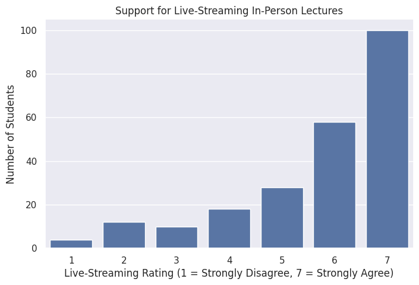
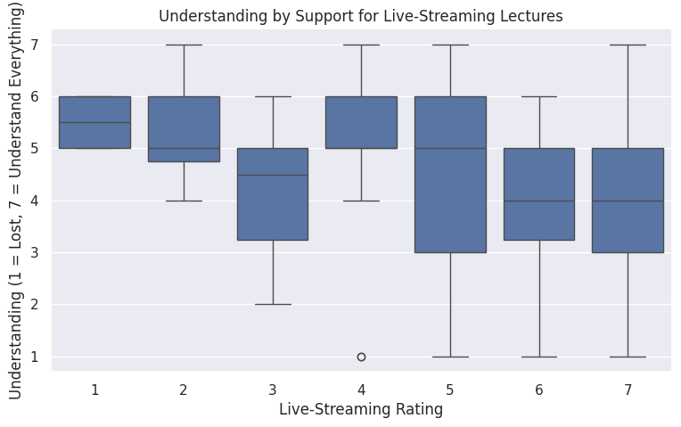
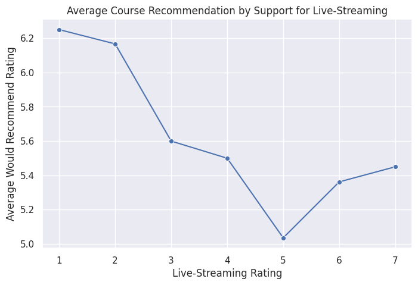
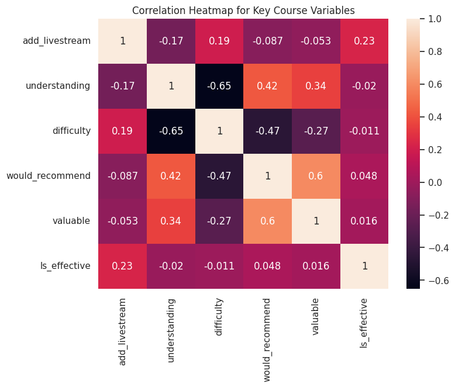

## Project Summary

My analysis was to explore if live-streaming in-person lectures could create value for COMP110 students. The data overall suggests that support for live-streaming lectures is moderate to high. Many students showed a positive response toward live-streaming, which indicates that students place high value on flexibility and accessibility for in-person lectures.

Looking at the relationship between course understanding and support for live-streaming was clear, as overall students with lower understanding showed more support for live-streaming lectures. When understanding was compared across groups, the results were fairly similar, suggesting that live-streaming would improve convenience without affecting the overall opinion of the course.

The data partially supports the idea that overall live-streaming lectures could improve COMP110. Staying up to date and not missing class content seems to be the strongest benefit of this idea. While there are overall positive results, trade-offs can occur because in-person attendance and participation may decrease.

## Visualizations

### Support for Live-Streaming Lectures

### Understanding by Support for Live-Streaming Lectures

### Average Course Recommendation by Support for Live-Streaming

### Correlation Heatmap for Key Course Variables 

## Final Conclusion

My analysis explored whether live-streaming in-person lectures could create value for students in COMP110. Overall, the data suggests that student support for live-streaming lectures is moderate to high, with many students showing positive responses toward having lectures available remotely. This indicates that students value flexibility and accessibility, especially when they are sick, have scheduling conflicts, or cannot attend class in person.

The relationship between support for live-streaming and understanding was somewhat clear. Students who supported live-streamed lectures often reported slightly lower understanding, suggesting that students who feel less confident in class may benefit most from having the option to review lectures remotely. The course recommendation results were fairly similar across groups, which suggests that live-streaming may improve convenience without negatively affecting students’ overall opinion of the course.

Overall, the data partially supports the idea that live-streaming lectures could improve COMP110. The strongest benefit is that it helps students stay caught up and reduces the stress of missing important class content. However, there are also trade-offs. Live-streaming may reduce in-person attendance, lower classroom participation, and require additional technology setup and instructor support.

As future work, COMP110 could test this idea by live-streaming a few lectures during more difficult units and collecting student feedback afterward. The course could also compare attendance, quiz scores, and student satisfaction before and after implementing live-streaming. Based on this analysis, live-streaming in-person lectures is a promising improvement that should be tested further before becoming a permanent part of the course.